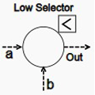
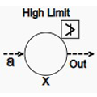

* High Low Selector
* High Low Limiter
* Rate Limiter

Introduction: In any process industry the safety of the plant is of prime concern. Every care is being taken while designing the control strategy to ensure safety of the plant. In any plant three types of safety aspects are designed and implemented. These are

* Interlocks
* Regulatory control
* Safety Instrumented Systems (SIS)

Interlocks come under the first level of safety. The purpose of interlocks (Either hard wired or soft interlocks through programming) is to ensure that in any case the process parameter remains in the safe region of operation. In case the plant need to be shut down , due to any reason, like failure of process loop component, regulatory system failure, or malfunctioning of the safety systems, then a systematic approach is to be designed, deployed, and tested for its effective working. The components under study are from that family of process loop components which need to study properly so as to select appropriate component for an appropriate application. To select these components a clear understanding of working of these components are essential. In this experiment a step by step approach is developed so as to gain the confidence in working of the components and then selecting them for a particular application.

Mainly the components used for interlocks are catagorised in following sections:

* Selectors: A component used to select the required parameter level based on the application demand and pass the value to regulatory controller for its further processing.
** High Selectors: A component which will compare the process parameter based on multiple sensors installed and pass "Highest" amongst all, to the regulatory device. It can be based on either two or many inputs from the transmitters installed. The number of inputs to high selector depends on the process requirement and redundancy requirement for safety. The symbol of the high selector is as shown:

** Low Selectors: A component which will compare the process parameter based on multiple sensors installed and pass "Lowest" amongst all, to the regulatory device. It can be based on either two or many inputs from the transmitters installed. The number of inputs to low selector depends on the process requirement and redundancy requirement for safety. The symbol of the low selector is as shown:

* Limiters: A component used to select the required parameter level based on the application demand and limit the value to regulatory controller so that the excess or less is not passed.
** High Limiter: A component which will not allow the process parameter to cross a set limit by the process engineer. In this case the limiter will have two inputs one as defined by the process engineer (set point) and the other from the transmitter. The component will compare the SP and PV and in any case it will not allow the output to go above set limit. The symbol of the high limiter is as shown:

** Low limiter: A component which will not allow the process parameter to cross a set limit by the process engineer. In this case the limiter will have two inputs one as defined by the process engineer (set point) and the other from the transmitter. The component will compare the SP and PV and in any case it will not allow the output to go below set limit. The symbol of the low limiter is as shown:

	

** Rate limiter: In certain process e.g. thermal run away processes, the rate at which process variable is changing needs to be monitored and controlled. The process engineer will set this limit and the rate limiter will compare the rate at which the process variable is changing, in case it crosses the set limit it will not allow the fast rising parameter to pass to the controller. The controller will then receive the change in parameter only with the set limit. The symbol of the rate limiter is as shown:

	

